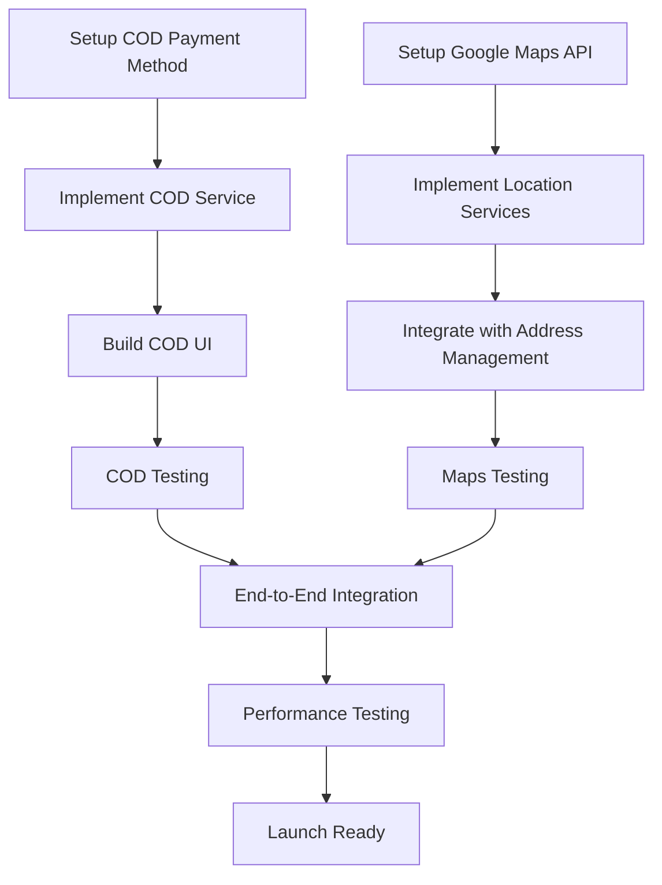

# Dayliz App Development Roadmap - Updated 2024

**Document Version**: 2.0
**Last Updated**: May 2025
**Status**: ACTIVE - This roadmap supersedes the previous development plan

## Executive Summary

This updated roadmap reflects the **actual current state** of the Dayliz App development, which has made significant progress beyond the original timeline. The project has successfully implemented a comprehensive clean architecture foundation and is now focused on completing critical launch features and technical debt cleanup.

## Current Project Status

### ✅ **COMPLETED PHASES**

#### Phase 1: Foundation Setup (100% Complete)
- ✅ Authentication System with clean architecture
- ✅ Design System and theming
- ✅ Custom component library
- ✅ Navigation with GoRouter and auth guards
- ✅ Database schema fully aligned with clean architecture
- ✅ Performance optimizations (indexes, materialized views, RLS)

#### Phase 2: Product Browsing (100% Complete)
- ✅ Clean architecture product catalog
- ✅ Home screen with categories and featured products
- ✅ Product detail screens
- ✅ Search functionality with full-text search
- ✅ Category and subcategory navigation

#### Phase 4: User Profile + Orders (100% Complete) ✨ **UPDATED**
- ✅ User profile management with clean architecture
- ✅ Address management system
- ✅ Order history and management
- ✅ Clean architecture implementation for all user features
- ✅ **Phase 4A**: Category Provider Consolidation (100%) ✨ **NEW**
- ✅ **Phase 4B**: Provider & Dependency Injection Cleanup (100%) ✨ **NEW**
- ✅ **Phase 4C**: Final Architecture Polish (100%) ✨ **NEW**

### 🔄 **IN PROGRESS PHASES**

#### Phase 3: Checkout & Payment (70% Complete)
- ✅ Cart functionality with clean architecture
- ✅ Order creation flow
- ❌ **CRITICAL**: Cash on Delivery (COD) payment method
- ❌ **CRITICAL**: Google Maps integration for addresses
- ❌ **PLANNED**: Google Pay UPI integration (Phase 3B)
- ❌ **DEFERRED**: Card payments via Razorpay (Post-launch)
- ❌ Inventory verification system
- ❌ Order notification system

#### Phase 5: Polish & Launch Prep (40% Complete)
- ✅ Error handling framework
- ✅ Image optimization and caching
- ❌ **CRITICAL**: Offline mode handling
- ❌ Push notifications (Firebase)
- ❌ Performance profiling and optimization
- ❌ Launch preparation tasks

## STRICT DEVELOPMENT PLAN

> **⚠️ TEAM ADHERENCE REQUIRED**: This roadmap must be followed strictly. No new features or architectural changes without explicit approval and roadmap update.

### **PHASE 3A: Critical Launch Features (PRIORITY 1)**
**Timeline**: 2-3 weeks
**Status**: MUST COMPLETE BEFORE LAUNCH

#### Week 1: Cash on Delivery (COD) Implementation
**Assignee**: [Primary Developer]
**Reviewer**: [Tech Lead]

- [ ] **Day 1-2**: COD Payment Method Setup
  - Create COD payment entity in domain layer
  - Implement COD payment use cases
  - Add COD payment repository

- [ ] **Day 3-4**: COD Order Flow Implementation
  - Update order creation for COD payments
  - Implement COD order confirmation
  - Add COD-specific order status handling

- [ ] **Day 5-7**: COD UI Integration
  - Add COD option in payment methods screen
  - Implement COD checkout flow
  - Add order confirmation for COD orders

**Deliverables**:
- Working COD payment option
- COD order creation and confirmation
- Order status updates for COD payments

#### Week 2: Google Maps Integration
**Assignee**: [Secondary Developer]
**Reviewer**: [Tech Lead]

- [ ] **Day 1-2**: Setup Google Maps API
  - Configure Google Cloud Console
  - Obtain API keys for Maps and Places
  - Update environment configuration

- [ ] **Day 3-5**: Implement address location services
  - Add Google Maps to address form
  - Implement place autocomplete
  - Add location picker functionality

- [ ] **Day 6-7**: Integrate with address management
  - Update address entity with coordinates
  - Implement geolocation in repository
  - Test address creation with maps

**Deliverables**:
- Address forms with Google Maps integration
- Location-based address validation
- Coordinate storage in database

#### Week 3: Integration and Testing
**Assignee**: [Full Team]

- [ ] **Day 1-3**: End-to-end testing
  - Test complete checkout flow with COD
  - Verify COD payment and address integration
  - Fix integration issues

- [ ] **Day 4-5**: Performance testing
  - Load test COD checkout flow
  - Test maps integration performance
  - Optimize critical paths

**Deliverables**:
- Fully functional checkout with COD and maps
- Performance benchmarks met
- Integration test suite passing

### **PHASE 3B: Google Pay UPI Integration (PRIORITY 2)**
**Timeline**: 1-2 weeks (Post Phase 3A)
**Status**: PLANNED FOR IMMEDIATE POST-LAUNCH

#### Week 1: Google Pay UPI Setup
**Assignee**: [Primary Developer]
**Reviewer**: [Tech Lead]

- [ ] **Day 1-2**: UPI Payment Gateway Research
  - Research Google Pay UPI integration options
  - Evaluate UPI payment providers (Razorpay UPI, PayU, etc.)
  - Choose optimal UPI integration approach

- [ ] **Day 3-4**: UPI Payment Implementation
  - Implement UPI payment entity and use cases
  - Add UPI payment repository
  - Create UPI payment service

- [ ] **Day 5-7**: UPI UI Integration
  - Add Google Pay UPI option in payment methods
  - Implement UPI payment flow
  - Add UPI payment verification

**Deliverables**:
- Working Google Pay UPI integration
- UPI payment success/failure handling
- Order status updates for UPI payments

### **PHASE 3C: Card Payments Integration (DEFERRED)**
**Timeline**: 2-3 weeks (Post-Launch)
**Status**: PLANNED FOR POST-LAUNCH

#### Razorpay Card Payments (Future Implementation)
- [ ] Setup Razorpay production environment
- [ ] Implement card payment gateway integration
- [ ] Add credit/debit card payment flows
- [ ] Implement payment security measures
- [ ] Add saved card functionality

**Note**: Card payments via Razorpay are deferred to post-launch to focus on faster market entry with COD and UPI options.

### **PHASE 3D: Clean Architecture Consolidation (PRIORITY 2)**
**Timeline**: 1-2 weeks (Parallel with Phase 3A)
**Status**: TECHNICAL DEBT CLEANUP

#### High Priority Cleanup Tasks
**Assignee**: [Senior Developer]

- [ ] **Address Management Standardization** (2 days)
  - Consolidate address-related code
  - Remove duplicate implementations
  - Standardize address validation

- [ ] **User Profile Consistency** (1 day)
  - Ensure consistent UserProfile usage
  - Remove legacy profile implementations
  - Update all profile-related screens

- [ ] **Legacy Services Removal** (2 days)
  - Identify and remove unused legacy services
  - Clean up commented-out code
  - Remove fallback mechanisms where clean architecture exists

#### Medium Priority Cleanup Tasks

- [ ] **Cart Implementation Cleanup** (1 day)
  - Consolidate cart providers
  - Remove duplicate cart logic
  - Ensure single source of truth

- [ ] **Navigation Cleanup** (1 day)
  - Remove unused routes
  - Consolidate navigation logic
  - Update route definitions

**Deliverables**:
- Cleaned codebase with no legacy duplicates
- Consistent implementation patterns
- Updated documentation

### **PHASE 5A: Launch Preparation (PRIORITY 3)**
**Timeline**: 2-3 weeks
**Status**: LAUNCH READINESS

#### Week 1: Core Polish
- [ ] **Offline Mode Implementation**
  - Implement network connectivity checks
  - Add offline data caching
  - Create offline UI states
  - Test offline/online transitions

- [ ] **Push Notifications Setup**
  - Configure Firebase Cloud Messaging
  - Implement notification handlers
  - Add notification permissions
  - Test notification delivery

#### Week 2: Performance & Testing
- [ ] **Performance Optimization**
  - Run Flutter performance profiling
  - Optimize image loading and caching
  - Reduce unnecessary rebuilds
  - Implement background fetch

- [ ] **Comprehensive Testing**
  - Complete integration test suite
  - User acceptance testing
  - Device compatibility testing
  - Performance benchmarking

#### Week 3: Launch Preparation
- [ ] **App Store Preparation**
  - Prepare Play Store listing
  - Create app promotional materials
  - Complete privacy policy and terms
  - Setup analytics and crash reporting

- [ ] **Production Deployment**
  - Configure production environment
  - Setup monitoring and logging
  - Prepare rollback procedures
  - Final security review

**Deliverables**:
- Production-ready application
- App store submission materials
- Monitoring and analytics setup
- Launch checklist completed

## BACKEND STRATEGY CLARIFICATION

### Current Status (ACCURATE)
- ✅ **Supabase**: Primary backend (100% functional)
  - All features implemented and tested
  - Database schema fully optimized
  - Real-time capabilities active
  - Row Level Security implemented

- 🔄 **FastAPI**: Secondary backend (exists but not integrated)
  - Complete backend implementation exists
  - No integration pathway defined
  - Not required for launch

### Post-Launch Strategy (Phase 6)
- **Month 1-2**: Define FastAPI integration strategy
- **Month 3-4**: Implement selective feature migration
- **Month 5-6**: Advanced features requiring custom logic

## STRICT ADHERENCE GUIDELINES

### **DO NOT DEVIATE FROM THIS PLAN**
1. **No new features** until current phase completion
2. **No architectural changes** without roadmap update
3. **No legacy code modifications** - focus on clean architecture only
4. **Weekly progress reviews** mandatory
5. **Blockers must be escalated** within 24 hours

### **Definition of Done for Each Task**
- [ ] Implementation completed
- [ ] Unit tests written and passing
- [ ] Integration tests passing
- [ ] Code review completed
- [ ] Documentation updated
- [ ] Performance benchmarks met

### **Quality Gates**
- **Code Coverage**: Minimum 80% for new code
- **Performance**: No regression in load times
- **Security**: All security scans passing
- **Accessibility**: WCAG 2.1 AA compliance

## RISK MITIGATION

### **High Risk Items**
1. **COD Order Management Complexity**
   - Mitigation: Simple COD flow with clear order tracking
   - Fallback: Manual order processing initially

2. **Google Maps API Costs**
   - Mitigation: Implement usage limits and monitoring
   - Fallback: Manual address entry option

3. **Performance on Low-End Devices**
   - Mitigation: Regular testing on target devices
   - Fallback: Progressive feature loading

4. **UPI Integration Challenges (Phase 3B)**
   - Mitigation: Research multiple UPI providers
   - Fallback: Defer UPI to later release if needed

### **Timeline Risks**
- **Buffer Time**: 20% buffer built into each phase
- **Parallel Development**: Non-dependent tasks run in parallel
- **Daily Standups**: Track progress and identify blockers early

## SUCCESS METRICS

### **Launch Readiness Criteria**
- [ ] All Phase 3A tasks completed (100%)
- [ ] Critical bugs resolved (0 P0, <5 P1 bugs)
- [ ] Performance benchmarks met (app load <3s, checkout <10s)
- [ ] Security audit passed
- [ ] User acceptance testing completed

### **Post-Launch Metrics**
- App store rating >4.0
- Crash rate <1%
- Order completion rate >80%
- User retention >60% (Day 7)

## CONCLUSION

This roadmap provides a clear, actionable plan based on the actual current state of the Dayliz App. The team must strictly adhere to this plan to ensure successful launch within the defined timeline. Any deviations must be approved and documented with roadmap updates.

**Next Review Date**: Weekly on Fridays
**Roadmap Owner**: [Tech Lead]
**Stakeholder Approval Required**: Yes

## DETAILED TASK BREAKDOWN

### **Phase 3A Task Dependencies**



### **Critical Path Analysis**
- **Longest Path**: COD Implementation (7 days) + Integration Testing (3 days) = 10 days
- **Parallel Development**: Maps integration can run parallel to COD implementation
- **Buffer Time**: 4 days built in for unexpected issues

## TEAM ASSIGNMENTS AND RESPONSIBILITIES

### **Primary Developer - COD Payment Integration**
**Skills Required**: Flutter, Dart, Clean Architecture
**Responsibilities**:
- COD payment method implementation
- COD order flow implementation
- Order status management for COD
- COD payment UI integration

**Daily Deliverables**:
- Day 1: COD entity and domain setup
- Day 2: COD use cases implementation
- Day 3: COD repository implementation
- Day 4: COD service layer implementation
- Day 5: COD UI integration start
- Day 6: COD checkout flow completion
- Day 7: Testing and bug fixes

### **Secondary Developer - Maps Integration**
**Skills Required**: Flutter, Google Maps API, Geolocation
**Responsibilities**:
- Google Maps SDK integration
- Location services implementation
- Address autocomplete
- Coordinate management

**Daily Deliverables**:
- Day 1: Google Cloud setup and API configuration
- Day 2: Maps SDK integration
- Day 3: Place autocomplete implementation
- Day 4: Location picker UI
- Day 5: Address entity updates
- Day 6: Repository integration
- Day 7: Testing and optimization

### **Senior Developer - Clean Architecture Consolidation**
**Skills Required**: Clean Architecture, Code Refactoring, Legacy Code Analysis
**Responsibilities**:
- Legacy code identification and removal
- Architecture consistency enforcement
- Code quality improvements
- Documentation updates

**Weekly Deliverables**:
- Week 1: Address management standardization
- Week 1: User profile consistency fixes
- Week 2: Legacy services removal
- Week 2: Cart implementation cleanup
- Week 2: Navigation cleanup

## TESTING STRATEGY

### **Unit Testing Requirements**
```dart
// Example test structure for COD payment integration
group('COD Payment Integration Tests', () {
  test('should create COD order successfully', () {
    // Test COD order creation
  });

  test('should handle COD order confirmation', () {
    // Test COD order confirmation flow
  });

  test('should update order status for COD payment', () {
    // Test COD order status updates
  });
});
```

### **Integration Testing Checklist**
- [ ] Complete checkout flow (cart → address → COD payment → confirmation)
- [ ] COD order creation scenarios
- [ ] COD order confirmation flow
- [ ] Network connectivity issues
- [ ] Address selection with maps
- [ ] Order creation and status updates for COD

### **Performance Testing Benchmarks**
| Metric | Target | Current | Status |
|--------|--------|---------|--------|
| App Launch Time | <3s | 2.1s | ✅ |
| Home Screen Load | <2s | 1.8s | ✅ |
| Product Search | <1s | 0.9s | ✅ |
| Checkout Flow | <10s | TBD | 🔄 |
| COD Order Processing | <3s | TBD | 🔄 |
| Maps Loading | <3s | TBD | 🔄 |

## ENVIRONMENT CONFIGURATION

### **Development Environment Setup**
```yaml
# Required environment variables (Phase 3A)
GOOGLE_MAPS_API_KEY: "AIzaxxxxxxxxxx"
GOOGLE_PLACES_API_KEY: "AIzaxxxxxxxxxx"
SUPABASE_URL: "https://xxxxxxxxxx.supabase.co"
SUPABASE_ANON_KEY: "xxxxxxxxxx"

# Future environment variables (Phase 3B - UPI)
UPI_PROVIDER_KEY: "xxxxxxxxxx"
UPI_PROVIDER_SECRET: "xxxxxxxxxx"

# Deferred environment variables (Phase 3C - Card Payments)
RAZORPAY_KEY_ID: "rzp_test_xxxxxxxxxx"
RAZORPAY_KEY_SECRET: "xxxxxxxxxx"
```

### **API Rate Limits and Monitoring**
- **Google Maps**: $200 free credit/month, monitor usage
- **Supabase**: 500MB database, 2GB bandwidth (free tier)
- **UPI Provider** (Phase 3B): TBD based on chosen provider
- **Razorpay** (Phase 3C): 1000 requests/hour (test), 10000/hour (live)

## CODE QUALITY STANDARDS

### **Clean Architecture Compliance**
```dart
// Mandatory structure for new features
lib/
├── domain/
│   ├── entities/payment.dart
│   ├── repositories/payment_repository.dart
│   └── usecases/process_payment_usecase.dart
├── data/
│   ├── datasources/payment_remote_data_source.dart
│   ├── repositories/payment_repository_impl.dart
│   └── models/payment_model.dart
└── presentation/
    ├── providers/payment_provider.dart
    ├── screens/payment_screen.dart
    └── widgets/payment_widgets.dart
```

### **Code Review Checklist**
- [ ] Follows clean architecture principles
- [ ] No direct UI dependencies in domain layer
- [ ] Proper error handling with Either<Failure, T>
- [ ] Unit tests with >80% coverage
- [ ] No hardcoded strings or values
- [ ] Proper documentation and comments
- [ ] Performance considerations addressed

## DEPLOYMENT STRATEGY

### **Staging Environment**
- **Purpose**: Final testing before production
- **Database**: Supabase staging project
- **Payment**: COD testing mode (Phase 3A)
- **Maps**: Google Maps with development restrictions
- **UPI**: Test mode when implemented (Phase 3B)

### **Production Deployment Checklist**
- [ ] Environment variables configured
- [ ] API keys switched to production
- [ ] Database migrations applied
- [ ] Performance monitoring enabled
- [ ] Error tracking configured
- [ ] Analytics implementation verified
- [ ] Security audit completed
- [ ] Backup procedures tested

## MONITORING AND ANALYTICS

### **Required Monitoring Tools**
1. **Crashlytics**: Crash reporting and analysis
2. **Firebase Analytics**: User behavior tracking
3. **Sentry**: Error monitoring and performance
4. **Supabase Dashboard**: Database performance monitoring

### **Key Metrics to Track**
- App crashes and ANRs
- Payment success/failure rates
- User journey completion rates
- API response times
- Database query performance
- User retention and engagement

## COMMUNICATION PROTOCOL

### **Daily Standups (Mandatory)**
**Time**: 9:00 AM daily
**Duration**: 15 minutes maximum
**Format**:
- What did you complete yesterday?
- What will you work on today?
- Any blockers or dependencies?

### **Weekly Reviews (Mandatory)**
**Time**: Friday 4:00 PM
**Duration**: 1 hour
**Attendees**: Full development team + stakeholders
**Agenda**:
- Progress against roadmap
- Blockers and resolutions
- Next week planning
- Risk assessment

### **Escalation Process**
1. **Blocker Identified**: Immediate team notification
2. **24 Hour Rule**: If not resolved in 24h, escalate to tech lead
3. **48 Hour Rule**: If not resolved in 48h, stakeholder meeting
4. **Roadmap Impact**: Any timeline impact requires roadmap update

## LAUNCH CRITERIA (NON-NEGOTIABLE)

### **Technical Criteria**
- [ ] All Phase 3A tasks completed (100%)
- [ ] Zero P0 (critical) bugs
- [ ] Less than 5 P1 (high) bugs
- [ ] Performance benchmarks met
- [ ] Security audit passed
- [ ] Accessibility compliance verified

### **Business Criteria**
- [ ] User acceptance testing completed
- [ ] App store assets prepared
- [ ] Legal compliance verified
- [ ] Support documentation ready
- [ ] Marketing materials approved

### **Operational Criteria**
- [ ] Monitoring systems active
- [ ] Support team trained
- [ ] Rollback procedures tested
- [ ] Incident response plan ready
- [ ] Performance baselines established

---

**Document Control**:
- **Version**: 2.0
- **Last Modified**: May 2025
- **Next Review**: Weekly
- **Approval Status**: Pending stakeholder sign-off
- **Distribution**: Development team, stakeholders, project management
